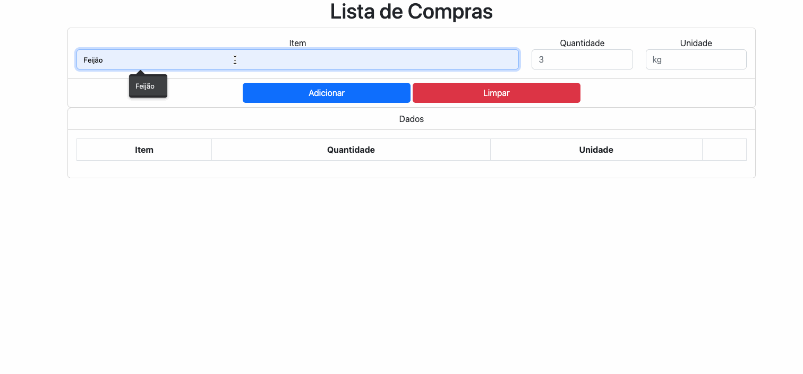
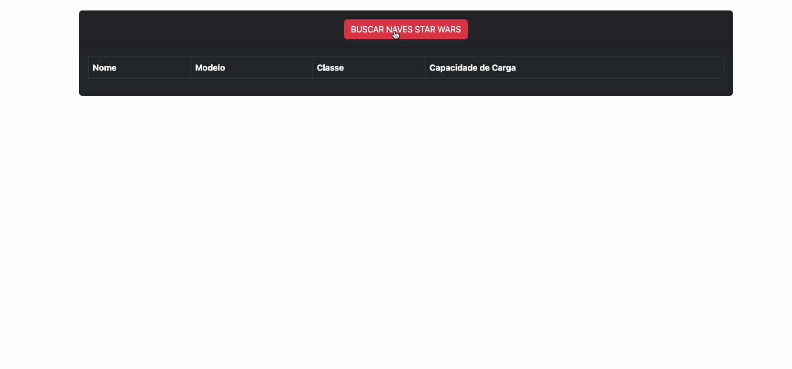
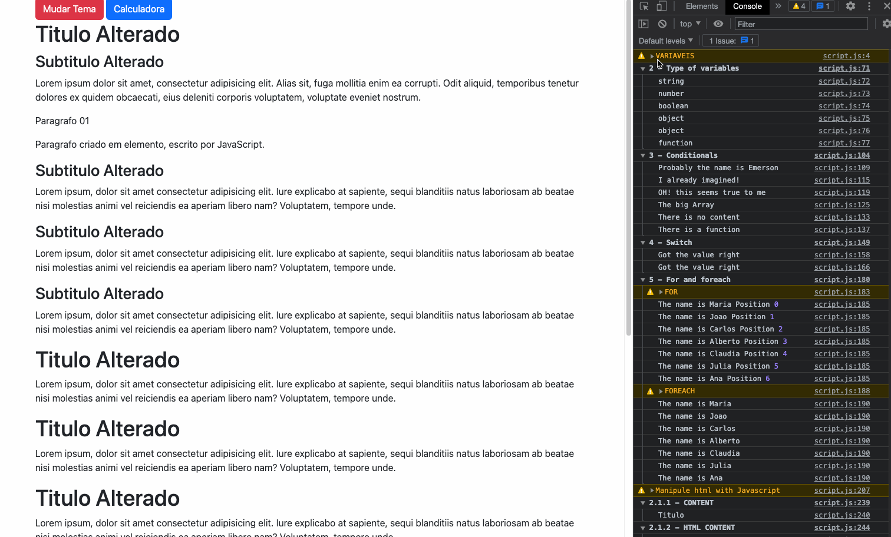

# Entra21_JavaScript_Test_2022

## 📃&nbsp; About the project

Practical activity to consolidate the subjects studied during the JavaScript module.
The following technologies were used:
- JavaScript
- HTML5
- CSS3
- jQuery
- Bootstrap
- Google Icons

 

| Task 💻 | Repositories | Test Here |
|------|---------|---------|
|🛠️&nbsp; JavaScrip / jQuery|[
🗂
](./js_jquery/)|[
▶️
](https://seiler-emerson.github.io/Entra21_JavaScript_Test_2022/tree/main/js_jquery/)|
|📊&nbsp; CRUD|[
🗂
](./crud/)|[
▶️
](https://seiler-emerson.github.io/Entra21_JavaScript_Test_2022/tree/main/crud)|
|🧑🏻‍💻&nbsp; API|[
🗂
](./api/)|[
▶️
](https://seiler-emerson.github.io/Entra21_JavaScript_Test_2022/tree/main/api)|

## ▶️&nbsp; Application in operation 

### CRUD

### API CONSUMPTION

### Pratice JavaScript and jQuery

